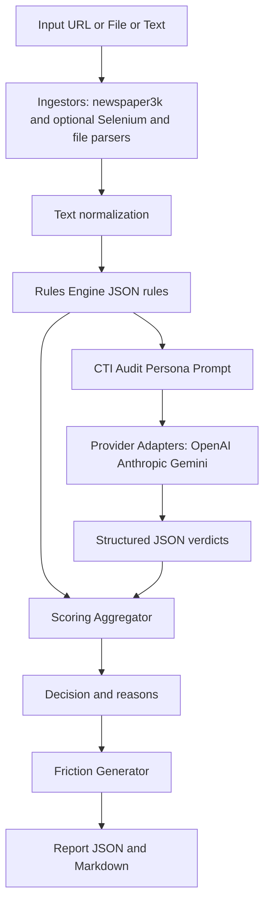

# STOP THE SLOP


## Install

```bash
bash installer.sh
cp .env.example .env  # optional for CLI
source .venv-cyberslop-py3*/bin/activate
```

## Run

```bash
streamlit run app_streamlit.py
# or
python cli.py --help
```

## Mermaid workflow



## Secrets configuration

For Streamlit runs, put secrets in `.streamlit/secrets.toml`.

```toml
OPENAI_API_KEY = "sk-..."
ANTHROPIC_API_KEY = "..."
GOOGLE_API_KEY = "..."
SLOPWATCH_MAX_CHARS = 200000
SLOPWATCH_TIMEOUT_SEC = 20
```

The code reads secrets in this order: st.secrets then `.streamlit/secrets.toml` then environment variables.
The CLI still supports `.env` via python-dotenv. You can also place a `.streamlit/secrets.toml` in the project and the CLI will read it.

## Threat model

SSRF guard, timeouts, JSON only outputs, and no code execution.

## License

Apache 2.0
